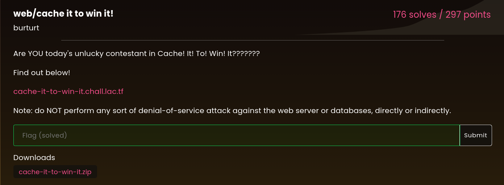
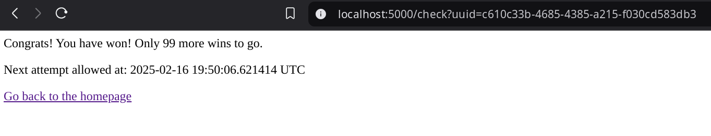
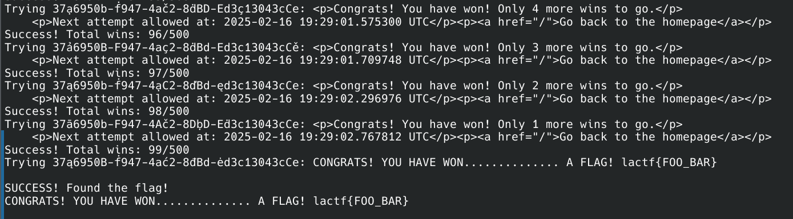

# LA CTF 2025 - web/cache it to win it!



The challenge was to exploit the caching mechanism of a web application (see `original_challenge` dir) to get the flag. The app generates a random uuid and stores in the DB + returns it to the user as a cookie. Now upon visitting the `/check` page a counter in the DB gets incremented for requested UUID. The goal of the game is to get the counter down to 0. But requests are cached so the same ID can actually get us down to 99 and it sticks there no matter how many times the page is refreshed.



The solution was to find a way to generate variations of the UUID so that the caching key is different but it still maps to the same UUID in the database. After testing few ideas (e.g. the `normalise_uuid` function was bugged to not always remove all hyphens) I realised there's a discrepancy between the way caching key is interpreted by `flask_caching` and how `MariaDB` interprets it. 

MariaDB by default comes set up with `utf8mb4_unicode_ci` collation meaning it will be case-insensitive, but also accent-insensitive. It does not seem to apply to flask caching though. 

So I asked my dear Claude Sonnet to come up with a program which will grab a valid UUID from the server and generate variations of it that will share the same cache key but be different in DB.

Here's the accent map limited to the characters valid for an UUID (hex):
```
fn get_special_char(c: char) -> char {
    const CHARS: [(char, &[char]); 6] = [
        ('a', &['ą', 'ă', 'ā', 'ạ', 'ả']),
        ('b', &['ḃ', 'ḅ', 'ƀ', 'ɓ']),
        ('c', &['ć', 'č', 'ċ', 'ç']),
        ('d', &['ď', 'ḋ', 'đ', 'ɗ']),
        ('e', &['ę', 'ě', 'ė', 'ẹ']),
        ('f', &['ḟ', 'ƒ'])
    ];
```

The program then simply visits the `/check` subpage with each variation until it gets the FLAG keyword in the response. From the caching perspective each request is different so it lets us bypass the cache. But mariaDB keeps hitting the same row.



# Usage

```bash
cd exploit
cargo run
```
(alternatively change the target host in `main.rs`)
